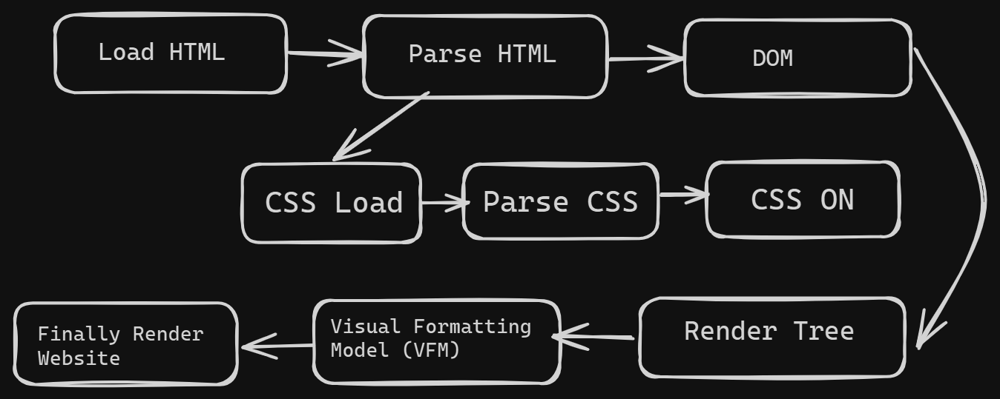

## Document Object Model (DOM)

The Document Object Model (DOM) is a programming interface for web documents. It represents the page so that programs can change the document structure, style, and content. The DOM represents the document as nodes and objects; that way, programming languages can interact with the page.



## Searching Element from DOM
There are six primary methods for searching elements within the DOM using JavaScript

- ```getElementById(id)```:
This method returns a single element that matches the provided ID. IDs are unique within a document, so this method efficiently retrieves a specific element.

- ```getElementsByClassName(names)```:
This method returns a live HTMLCollection of all elements that have the specified class names. It searches the entire document for matching elements.

- ```getElementsByTagName(name)```:
This method returns a live HTMLCollection of all elements with the given tag name. It searches the entire document.

- ```getElementsByName(name)```:
This method returns a live NodeList of all elements with the given name. It's primarily used for elements like form elements that can have the same name.

- ```querySelector(selectors)```:
This method returns the first element that matches a specified CSS selector. It's a powerful method for selecting elements based on various criteria.

- ```querySelectorAll(selectors)```:
This method returns a static NodeList of all elements that match a specified CSS selector. Like querySelector(), it uses CSS selectors to find elements.