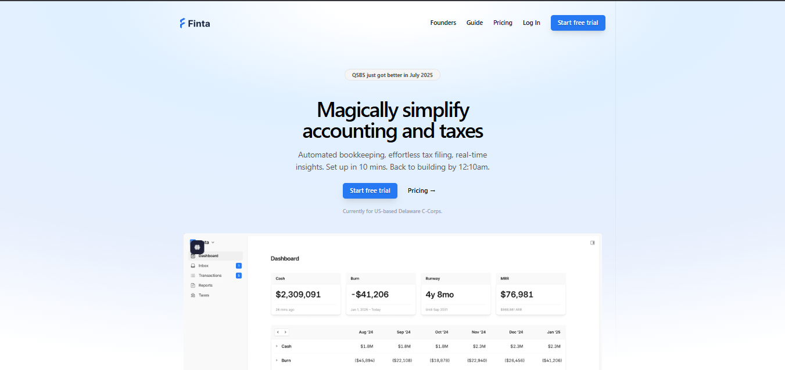

# Finta Redesign – TailwindCSS

This project is a redesign of the Finta landing page, built using [TailwindCSS](https://tailwindcss.com/).  
It is part of the [crack-the-frontend](https://github.com/crack-the-frontend) repository.

## Features

- Modern radial gradient background
- Clean navigation bar
- Hero section with call-to-action buttons
- Preview image included

## Getting Started

1. Clone the repository.
2. Install dependencies:
   ```
   npm install
   ```
3. Start the development server:
   ```
   npm run dev
   ```
4. Open [http://localhost:3000](http://localhost:3000) to view the page.

## Preview



## Built With

- [TailwindCSS](https://tailwindcss.com/)
- React

---

Feel free to use or modify this redesign for your own projects.
