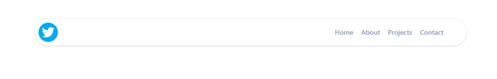
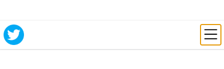
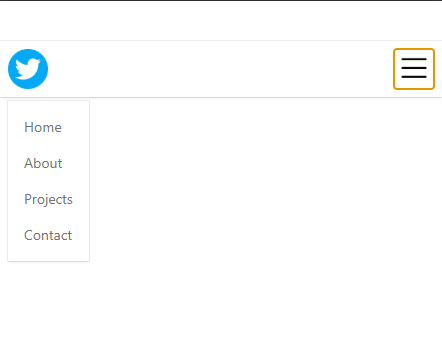

# Responsive Design in Tailwind CSS

In this project, I explored **responsive design** using Tailwind CSS. Tailwind provides a powerful and intuitive way to build responsive layouts by using its built-in [breakpoints](https://tailwindcss.com/docs/responsive-design). These breakpoints allow you to apply different utility classes at various screen sizes, making it easy to create layouts that adapt to any device.

## Responsive Breakpoints in Tailwind

Tailwind's default breakpoints are:

- `sm` — 640px
- `md` — 768px
- `lg` — 1024px
- `xl` — 1280px
- `2xl` — 1536px

You can use these prefixes to apply styles conditionally. For example, `md:flex` will apply the `flex` utility only on medium screens and above.

## Responsive Navbar Example

I created a responsive navbar that adapts to different screen sizes. On larger screens, the menu items are displayed horizontally. On smaller screens, the menu collapses into a hamburger menu for better usability.

Below are preview images of the responsive navbar in action:

This demonstrates how Tailwind's responsive utilities make it straightforward to build adaptive and user-friendly interfaces. By leveraging these tools, you can ensure your web applications look great and function well on any device, providing an optimal user experience.
